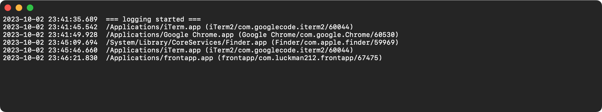

## frontapp

Keeps a running log of the current focused app in macOS. Also displays a menubar item with the name of the frontmost app.

The following details are logged to the window:

- timestamp (millisecond accuracy)
- full pathname
- "friendly" AppName
- Bundle ID
- PID

Click the menubar item to toggle (hide/show) the window. The window can also be resized and will remember its size and position.

There is a small (optional) beep sound that will play when an app change is detected. You can toggle this via the *frontapp* menu at the top left.

## screenshots

#### menubar item

#### log window

